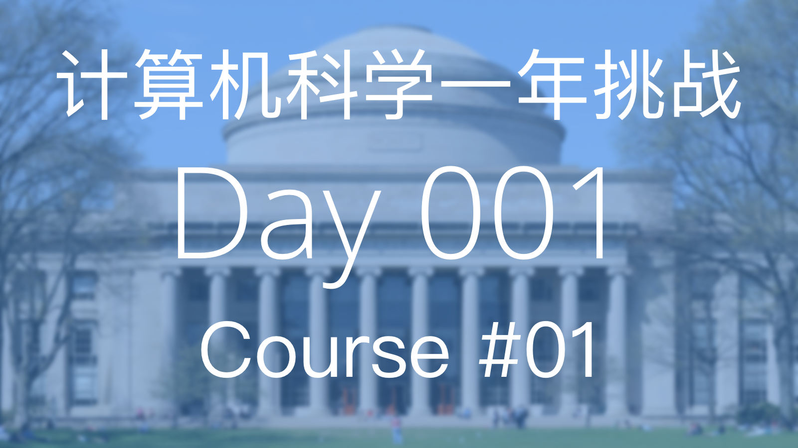

# 计算机科学简介与使用 Python 进行编程

6.00.1x 将介绍怎么使用计算机科学来分析与解决现实中的问题

**资源**

- [课程链接]( https://www.edx.org/course/introduction-computer-science-mitx-6-00-1x-6#!)
- [课本链接](https://mitpress.mit.edu/books/introduction-computation-and-programming-using-python-0)

## Week 1: 简介与编程的核心元素

### Lecture 1: 简介

今天我们学到的内容有计算和计算思维（Computational Thinking）的基本原则。

计算机只做两件事并做的非常好，**计算** 和 **储存**。

计算机里的存储单元的基本单位为 **字节** (byte)，他们看起来就像是这样，`00000000`。

**计算模式思维** 指把任何问题都当做可以被数字和公式去解决的数学问题。

知识分为两种类型，
- 陈述性 (Declarative) 知识，用以阐述客观事实
- 流程性 (Imperative) 知识，用以阐述“怎么样能够...”的一系列步骤

在计算机科学中我们更注重的是流程性的知识，因为它可以帮我们解决问题。

计算机有两种类型，

- 固定型 (Fixed)，被设计用于执行特定的事情（例如，计算器）
- 存储型 (Stored)，可存储和操作用户指令
  - 用户指令是基于原始内置指令构建封装而成，原始内置指令 (Primitive Instructions) 包括：
    - 算数单元 (Arithmetic) 和逻辑单元 (Logic)
    - 简单的测试单元
    - 对于数据的操作
  - 解析器（Interpreter）用于执行指令
    - 使用测试单元进行流程控制 (Flow of Control)

*基础计算机结构*

- 内存 (Memory)，用于存储用户指令和运行所得到的结果
- 算数逻辑单元 (Arithmetic Logic Unit)，完成原始操作指令的运行
- 控制单元 (Control Unit)，控制运行流程，控制算数逻辑单元执行某条命令

计算机的运算流程，

1. 内存中存储了一系列指令 (Instructions)
2. 在控制单元中会初始化一个程序计数器 (Program Counter) 指向内存序列中的第一条指令，当程序开始运行时，解析器会从这条指令开始执行
3. 执行这条指令时，会从内存中取出数值，在算数逻辑单元中运行，运行结束后会将结果返回给内存
4. 程序计数器的数值加 `1` ，以为着指向下一条将要被执行的指令。直至所有命令运行完毕

流程控制可以改变程序计数器的数值，这样就可以改变所执行的命令了。

任何一种编程语言都有下面的四个特性，

1. 它提供了基础的操作指令（Primitive Constructs），例如数据类型和操作符号
2. 句法（Syntax），怎么样的代码是合法的字符串，比如中文句子需要在结尾处有句号
3. 静态语义（Static Semantics），在未执行代码时，代码是有意义的。例如，`狗吃阳光。`是一个符合句法的句子，但是它本身并无意义因为狗不能吃阳光
4. 语义（Semantics），在满足上述两条的情况下，每一句代码有且只有唯一的一个意思

随之而来也会产出两种错误，

- 语法错误（Syntax Error)，常见但很容易被计算机捕获到，在运行程序之前即可被发现
- 语义错误（Semantics Error），一部分语言在运行程序前检查，另一些语言在解析时检查
