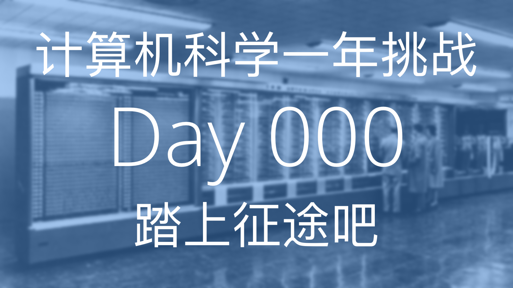
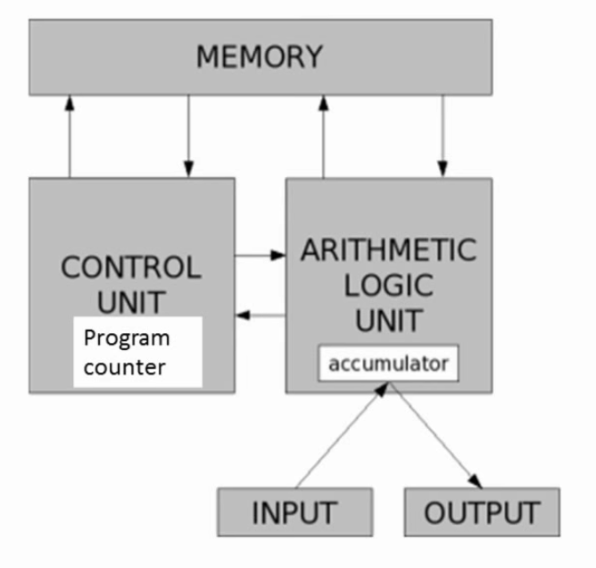
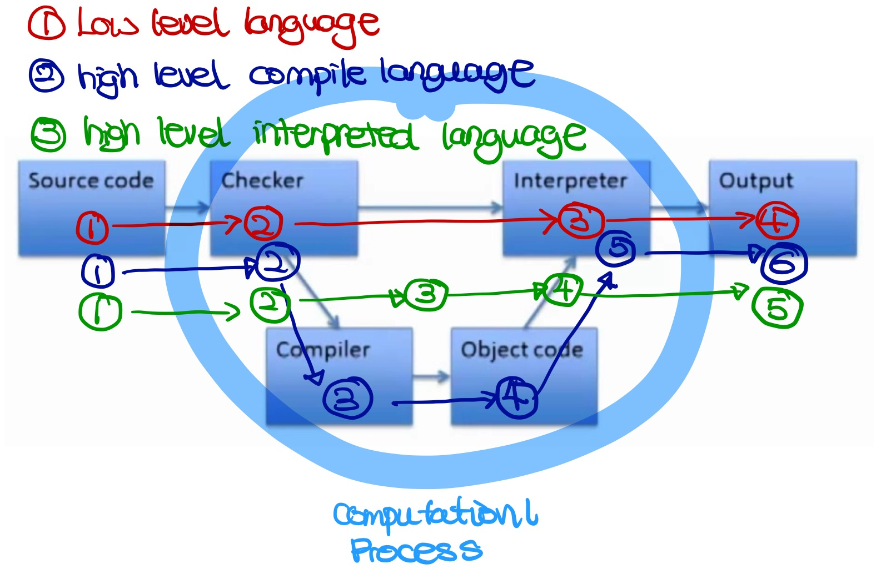

# 计算机科学简介与使用 Python 进行编程

6.00.1x 将介绍怎么使用计算机科学来分析与解决现实中的问题

**资源**

- [课程链接]( https://www.edx.org/course/introduction-computer-science-mitx-6-00-1x-6#!)
- [课本链接](https://mitpress.mit.edu/books/introduction-computation-and-programming-using-python-0)

## Week 1: 简介与 Python 编程基础

### Lecture 1: 简介



今天我们学到的内容有计算和计算思维（Computational Thinking）的基本原则。

计算机只做两件事并做的非常好，**计算** 和 **储存**。

计算机里的存储单元的基本单位为 **字节** (byte)，他们看起来就像是这样，`00000000`。

**计算模式思维** 指把任何问题都当做可以被数字和公式去解决的数学问题。

知识分为两种类型，
- 陈述性 (Declarative) 知识，用以阐述客观事实
- 流程性 (Imperative) 知识，用以阐述“怎么样能够...”的一系列步骤

在计算机科学中我们更注重的是流程性的知识，因为它可以帮我们解决问题。

计算机有两种类型，

- 固定型 (Fixed)，被设计用于执行特定的事情（例如，计算器）
- 存储型 (Stored)，可存储和操作用户指令
  - 用户指令是基于原始内置指令构建封装而成，原始内置指令 (Primitive Instructions) 包括：
    - 算数单元 (Arithmetic) 和逻辑单元 (Logic)
    - 简单的测试单元
    - 对于数据的操作
  - 解析器（Interpreter）用于执行指令
    - 使用测试单元进行流程控制 (Flow of Control)



*基础计算机结构*

- 内存 (Memory)，用于存储用户指令和运行所得到的结果
- 算数逻辑单元 (Arithmetic Logic Unit)，完成原始操作指令的运行
- 控制单元 (Control Unit)，控制运行流程，控制算数逻辑单元执行某条命令

计算机的运算流程，

1. 内存中存储了一系列指令 (Instructions)
2. 在控制单元中会初始化一个程序计数器 (Program Counter) 指向内存序列中的第一条指令，当程序开始运行时，解析器会从这条指令开始执行
3. 执行这条指令时，会从内存中取出数值，在算数逻辑单元中运行，运行结束后会将结果返回给内存
4. 程序计数器的数值加 `1` ，以为着指向下一条将要被执行的指令。直至所有命令运行完毕

流程控制可以改变程序计数器的数值，这样就可以改变所执行的命令了。

任何一种编程语言都有下面的四个特性，

1. 它提供了基础的操作指令（Primitive Constructs），例如数据类型和操作符号
2. 句法（Syntax），怎么样的代码是合法的字符串，比如中文句子需要在结尾处有句号
3. 静态语义（Static Semantics），在未执行代码时，代码是有意义的。例如，`狗吃阳光。`是一个符合句法的句子，但是它本身并无意义因为狗不能吃阳光
4. 语义（Semantics），在满足上述两条的情况下，每一句代码有且只有唯一的一个意思

随之而来也会产出两种错误，

- 语法错误（Syntax Error)，常见但很容易被计算机捕获到，在运行程序之前即可被发现
- 语义错误（Semantics Error），一部分语言在运行程序前检查，另一些语言在解析时检查

### Lecture 2: Python 编程基础
今天我们学到的内容是编程语言 Python 的一些基础知识。

但我们想要将我们的一些基于计算思维的想法转换成计算能懂的机器语言的时候，编程语言就成为了两者间的媒介，编程语言定义了一些语法和语义来帮助我们进行转换。

我们再回忆一下，语法说明编程语言中，哪些符号或文字的组合方式是正确的，语义则是对于编程的解释

通过使用编程语言编写的对于计算的指令成为源代码 (source code)

编程语言的对比：
- 低级语言 (Low-level programming language) vs. 高级语言 (High-level programming language)
- 直译式语言 (Interpreted language) vs. 编译式语言 (Compiled language)



低级语言：
- 低级编程语言的语法与语义和计算机的机器语言极其相似
- 检查程序仅仅检查其语法的正确和静态语义的正确
- 仅仅是按照解析器 (interpreter) 所指向的命令顺序进行执行

高级语言：
- 直译式语言：这种类型的编程语言，会将代码一句一句转换成机器码运行
  - Python 为直译式编程语言
- 编译式语言：这种编程语言需要利用解释器，在运行期，动态将代码逐句直译（interpret）为机器码，或是已经预先编译为机器码的的子程序，之后再运行

最基本的 Python 解析器被称为 shell，用户可在其中直接输入命令来执行各种各样的任务

对象 (Objects) 是 Python 程序中操作的核心元素，对象定义了类型和程序可以对该对象进行的操作，有两种类型的对象：
- 基本对象 (Scalar Objects)：
  - `int`
  - `float`
  - `bool`
  - `None`
- 非基本对象 (Compound objects or Non-scalar objects)
  - `string`
  - etc.

表达式是由对象和操作符 (operators) 拼接而成

直线程序 (straight-line programs)

即按照命令顺序执行的程序

分支程序 (brunch programs)

分支程序允许我们根据不同的条件执行不同的程序

最简单的分支语句是条件语句 (conditional)
  - 条件语句都拥有一个判断条件，即一个能得出 `Ture` 或者 `False` 的布朗表达式
  - 条件语句都包含该两个代码块，即一个当判断条件为 `Ture` 的时候执行的代码，另一个是判断条件为 `False` 时执行的代码
  - 一个简单的判断程序：
  ```
  x = int(raw_input('Enter an integer:'))
  if x%2 == 0:
      print('')
      print('Even')
  else:
      print('')
      print('Odd')
  print('Done with conditional')
  ```
  - 使用 `==` 判断符进行比较判断
  - `=` 赋值运算符
  - 空格是非常重要的，Python 通过空格来区分代码块
  - 条件语句是可以嵌套的：
  ```
  if x%2 == 0:
      if x%3 == 0:
        print('Divisible by 2 and 3')
      else:
        print('Divisible by 2 and not by 3')
  elif x%3 == 0:
      print('Divisible by 3 and not by2')
  ```
    - `elif` 代表 `else if`
  - 使用组合判断条件表达式 (compound expressions)
