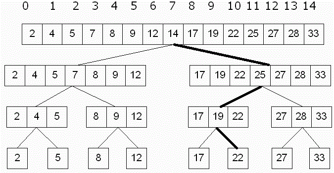

# 计算机科学简介与使用 Python 进行编程

6.00.1x 将介绍怎么使用计算机科学来分析与解决现实中的问题

**资源**

- [课程链接]( https://www.edx.org/course/introduction-computer-science-mitx-6-00-1x-6#!)
- [课本链接](https://mitpress.mit.edu/books/introduction-computation-and-programming-using-python-0)

## Week 1: 简介与 Python 编程基础

### Lecture 1: 简介


今天我们学到的内容有计算和计算思维（Computational Thinking）的基本原则。

计算机只做两件事并做的非常好，**计算** 和 **储存**。

计算机里的存储单元的基本单位为 **字节** (byte)，他们看起来就像是这样，`00000000`。

**计算模式思维** 指把任何问题都当做可以被数字和公式去解决的数学问题。

知识分为两种类型，
- 陈述性 (Declarative) 知识，用以阐述客观事实
- 流程性 (Imperative) 知识，用以阐述“怎么样能够...”的一系列步骤

在计算机科学中我们更注重的是流程性的知识，因为它可以帮我们解决问题。

计算机有两种类型，

- 固定型 (Fixed)，被设计用于执行特定的事情（例如，计算器）
- 存储型 (Stored)，可存储和操作用户指令
  - 用户指令是基于原始内置指令构建封装而成，原始内置指令 (Primitive Instructions) 包括：
    - 算数单元 (Arithmetic) 和逻辑单元 (Logic)
    - 简单的测试单元
    - 对于数据的操作
  - 解析器（Interpreter）用于执行指令
    - 使用测试单元进行流程控制 (Flow of Control)


*基础计算机结构*

- 内存 (Memory)，用于存储用户指令和运行所得到的结果
- 算数逻辑单元 (Arithmetic Logic Unit)，完成原始操作指令的运行
- 控制单元 (Control Unit)，控制运行流程，控制算数逻辑单元执行某条命令

计算机的运算流程，

1. 内存中存储了一系列指令 (Instructions)
2. 在控制单元中会初始化一个程序计数器 (Program Counter) 指向内存序列中的第一条指令，当程序开始运行时，解析器会从这条指令开始执行
3. 执行这条指令时，会从内存中取出数值，在算数逻辑单元中运行，运行结束后会将结果返回给内存
4. 程序计数器的数值加 `1` ，以为着指向下一条将要被执行的指令。直至所有命令运行完毕

流程控制可以改变程序计数器的数值，这样就可以改变所执行的命令了。

任何一种编程语言都有下面的四个特性，

1. 它提供了基础的操作指令（Primitive Constructs），例如数据类型和操作符号
2. 句法（Syntax），怎么样的代码是合法的字符串，比如中文句子需要在结尾处有句号
3. 静态语义（Static Semantics），在未执行代码时，代码是有意义的。例如，`狗吃阳光。`是一个符合句法的句子，但是它本身并无意义因为狗不能吃阳光
4. 语义（Semantics），在满足上述两条的情况下，每一句代码有且只有唯一的一个意思

随之而来也会产出两种错误，

- 语法错误（Syntax Error)，常见但很容易被计算机捕获到，在运行程序之前即可被发现
- 语义错误（Semantics Error），一部分语言在运行程序前检查，另一些语言在解析时检查

### Lecture 2: Python 编程基础

今天我们学到的内容是编程语言 Python 的一些基础知识。

当我们想要将我们的一些基于计算思维的想法转换成计算能懂的机器语言的时候，编程语言就成为了两者间的媒介，编程语言定义了一些句法和语义来帮助我们进行转换。

我们来回忆一下，句法（Syntax）说明编程语言中，哪些符号或字符的组合方式是合法的，语义（Semantic）则是对于编程所要表达意思的解释

通过使用编程语言编写的对于计算操作指令称为源代码 (Source Code)

编程语言的对比：
- 低级语言 (Low-level Programming Language) vs. 高级语言 (High-level Programming Language)
- 直译式语言 (Interpreted Language) vs. 编译式语言 (Compiled Language)


低级语言,
- 低级编程语言的语法与语义和计算机的机器语言极其相似
- 检查程序仅仅检查其语法的正确和静态语义的正确
- 仅仅是按照解析器 (Interpreter) 所指向的命令顺序进行执行

高级语言,
- 直译式语言：这种类型的编程语言，会将代码一句一句在执行前转换成机器码运行
  - Python 就是直译式的编程语言
- 编译式语言：这种编程语言需要利用解释器，在运行期，动态将代码逐句直译（Interpret）为机器码，或是已经预先编译为机器码的的子程序，之后再运行

最基本的 Python 解析器被称为 shell，用户可在其中直接输入命令来执行各种各样的任务

对象 (Objects) 是 Python 程序中操作的核心元素，对象定义了类型和程序可以对该对象进行的操作，有两种类型的对象：

- 基本对象 (Scalar Objects)：
  - `int`
  - `float`
  - `bool`
  - `None`
- 非基本对象 (Compound Objects 也称之为 Non-scalar Objects)
  - `string`
  - etc.

表达式是由对象和操作符 (Operators) 拼接而成。

直线程序 (Straight-line programs)，即按照命令顺序执行的程序

分支程序 (Brunch Programs)，分支程序允许我们根据不同的条件执行不同的程序

最简单的分支语句是条件语句 (Conditional)
  - 条件语句都拥有一个判断条件，即一个能得出 `Ture` 或者 `False` 的布尔（Boolean）表达式
  - 条件语句都包含该两个代码块，即一个当判断条件为 `Ture` 的时候执行的代码，另一个是判断条件为 `False` 时执行的代码

下面是一个简单的判断程序，

  ```
  x = int(raw_input('Enter an integer:'))
  if x%2 == 0:
      print('')
      print('Even')
  else:
      print('')
      print('Odd')
  print('Done with conditional')
  ```

Python 使用 `==` 判断符进行值之间的比较判断，一个 `=` 为赋值运算符。空格在 Python 中是非常重要的，因为 Python 用它来区分代码块。

## Week 2: 简介与 Python 编程基础

### Lecture 3: Python 的迭代循环以及算法基础

今天我们学到的内容是 Python 的迭代循环以及算法基础。

迭代循环 (Iteration Loop)，
1. 始于一个判断条件，判断条件返回 `Ture` 或者 `False`
2. 如果为 `Ture` ，则执行循环内部代码，然后再次进行判断，以此循环
3. 知道判断条件为 `False` 时，则跳出循环体

一个简单的例子，
```python
x = 4
ans = 0
itersLeft = x
while (itersLeft != 0):
  ans = ans + x
  itersLeft = itersLeft - 1
print(str(x) + '*' + str(x) + '=' + str(ans))
```
- 需要在循环体外面摄设置一个循环变量，该例子中分别为 `itersLeft`
- 对循环变量进行条件判断已决定什么时候终止循环，该例子中为 `itersLeft != 0`
- 在每次执行完循环体内的代码时，需要改变循环变量的数值，该例子中为 `itersLeft = itersLeft -1`，如果不改变，则每次判断的结果都相同，循环就不会终止

Python 中有两种迭代循环方法，
- While 循环 (While loops)
- For 循环 (For loops)

循环的特点，
- 循环变量(设置初始值，根据判断条件进行判断，在循环体内改变循环变量)，或者我们可称之为状态变量 (state variable)

我们来回忆一下，分支结构 (Branching Structures) 允许我们根据不同的条件执行不同的代码块，因此程序的执行时间是固定的 (contant time)，因为每个代码块被执行的次数至多为 1 次。

而循环结构允许我们根据不同的条件重复执行相同的代码块,程序的执行时间是根据循环次数而决定的。

计算机内部任何数值都会被转换成二进制数值来进行计算和存储

十进制整数转换二进制正数，

```python
is num < 0:
  isNeg = True
  num = abs(num)
else:
  isNeg = False
result = ''
if num == 0:
  result = '0'
while num > 0:
  result = str(num % 2) + result # <- get the binary digit
  num /= 2 # <- shift to right
if isNeg:
  result = '-' + result
```

十进制小数转换成二进制小数

```python
# Refer conversion steps above
p = 0
while ((2**p)*num)%1 != 0: # (1) Convert fractional into whole num
  p += 1
print "p:", p
num = int(num*(2**p))
result = ''
if num == 0:
  result = '0'
while num > 0: # (2) Convert decimal into binary
  result = str(num%2) + result
  num /= 2
for i in range(p - len(result)): # (3) Division, shift left
  result = '0' + result
result = result[0:-p] + '.' + result[-p:]
print str(num), 'Binary Representation', result
```

四种基础算法
- 猜测检查法 (Guess and Check method)
- 近似法 (Approximation Methods)
- 二元搜索法 (Bisection Search)
- 牛顿-拉弗森法（Newton-Raphson method）

猜测检查法

我们推测我们所要解决问题的结果，然后去检验它.

- 该方法只适用于有限的可能性。
- 猜测检查法的一个特例算法就是穷举法 (exhaustive enumeration)

近似法
- 需要一个近似范围，如果近似范围过于的小，则近似过程会非常长，如果近似范围过大，则结果误差会比较大。

二元搜索法 (Bisection Search)

- 与前两种方法相比，二分法能够有效的减少计算时间

牛顿-拉弗森法
