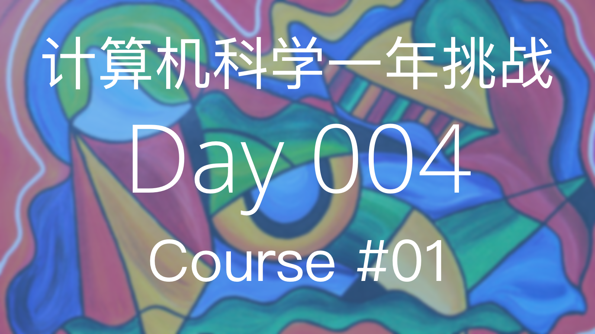
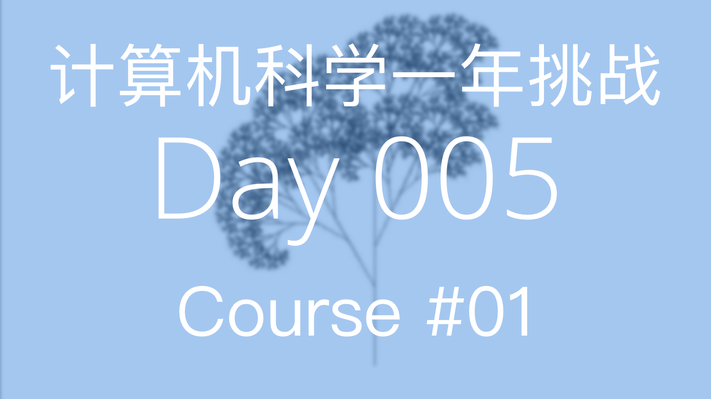
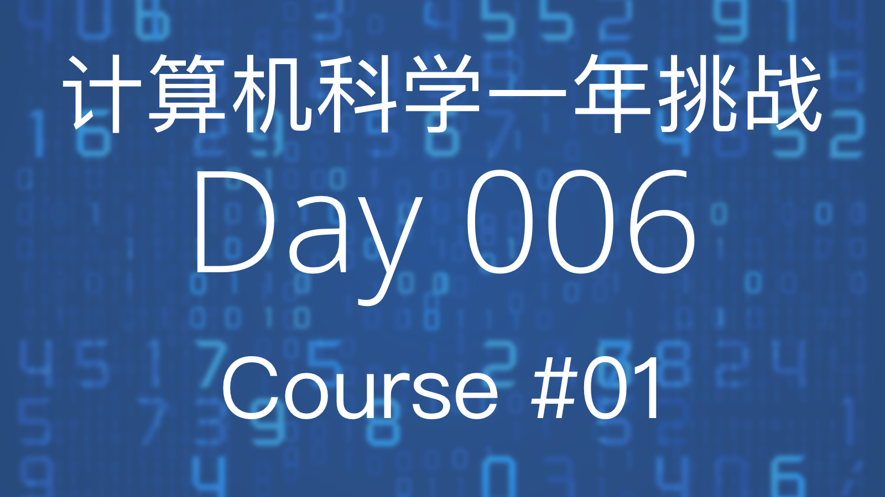

# 计算机科学简介与使用 Python 进行编程

6.00.1x 将介绍怎么使用计算机科学来分析与解决现实中的问题

**资源**

- [课程链接]( https://www.edx.org/course/introduction-computer-science-mitx-6-00-1x-6#!)
- [课本链接](https://mitpress.mit.edu/books/introduction-computation-and-programming-using-python-0)

## Week 1: 简介与 Python 编程基础

### Lecture 1: 简介


今天我们学到的内容有计算和计算思维（Computational Thinking）的基本原则。

计算机只做两件事并做的非常好，**计算** 和 **储存**。

计算机里的存储单元的基本单位为 **字节** (byte)，他们看起来就像是这样，`00000000`。

**计算模式思维** 指把任何问题都当做可以被数字和公式去解决的数学问题。

知识分为两种类型，
- 陈述性 (Declarative) 知识，用以阐述客观事实
- 流程性 (Imperative) 知识，用以阐述“怎么样能够...”的一系列步骤

在计算机科学中我们更注重的是流程性的知识，因为它可以帮我们解决问题。

计算机有两种类型，

- 固定型 (Fixed)，被设计用于执行特定的事情（例如，计算器）
- 存储型 (Stored)，可存储和操作用户指令
  - 用户指令是基于原始内置指令构建封装而成，原始内置指令 (Primitive Instructions) 包括：
    - 算数单元 (Arithmetic) 和逻辑单元 (Logic)
    - 简单的测试单元
    - 对于数据的操作
  - 解析器（Interpreter）用于执行指令
    - 使用测试单元进行流程控制 (Flow of Control)


*基础计算机结构*

- 内存 (Memory)，用于存储用户指令和运行所得到的结果
- 算数逻辑单元 (Arithmetic Logic Unit)，完成原始操作指令的运行
- 控制单元 (Control Unit)，控制运行流程，控制算数逻辑单元执行某条命令

计算机的运算流程，

1. 内存中存储了一系列指令 (Instructions)
2. 在控制单元中会初始化一个程序计数器 (Program Counter) 指向内存序列中的第一条指令，当程序开始运行时，解析器会从这条指令开始执行
3. 执行这条指令时，会从内存中取出数值，在算数逻辑单元中运行，运行结束后会将结果返回给内存
4. 程序计数器的数值加 `1` ，以为着指向下一条将要被执行的指令。直至所有命令运行完毕

流程控制可以改变程序计数器的数值，这样就可以改变所执行的命令了。

任何一种编程语言都有下面的四个特性，

1. 它提供了基础的操作指令（Primitive Constructs），例如数据类型和操作符号
2. 句法（Syntax），怎么样的代码是合法的字符串，比如中文句子需要在结尾处有句号
3. 静态语义（Static Semantics），在未执行代码时，代码是有意义的。例如，`狗吃阳光。`是一个符合句法的句子，但是它本身并无意义因为狗不能吃阳光
4. 语义（Semantics），在满足上述两条的情况下，每一句代码有且只有唯一的一个意思

随之而来也会产出两种错误，

- 语法错误（Syntax Error)，常见但很容易被计算机捕获到，在运行程序之前即可被发现
- 语义错误（Semantics Error），一部分语言在运行程序前检查，另一些语言在解析时检查

### Lecture 2: Python 编程基础


今天我们学到的内容是编程语言 Python 的一些基础知识。

当我们想要将我们的一些基于计算思维的想法转换成计算能懂的机器语言的时候，编程语言就成为了两者间的媒介，编程语言定义了一些句法和语义来帮助我们进行转换。

我们来回忆一下，句法（Syntax）说明编程语言中，哪些符号或字符的组合方式是合法的，语义（Semantic）则是对于编程所要表达意思的解释

通过使用编程语言编写的对于计算操作指令称为源代码 (Source Code)

编程语言的对比：
- 低级语言 (Low-level Programming Language) vs. 高级语言 (High-level Programming Language)
- 直译式语言 (Interpreted Language) vs. 编译式语言 (Compiled Language)


低级语言,
- 低级编程语言的语法与语义和计算机的机器语言极其相似
- 检查程序仅仅检查其语法的正确和静态语义的正确
- 仅仅是按照解析器 (Interpreter) 所指向的命令顺序进行执行

高级语言,
- 直译式语言：这种类型的编程语言，会将代码一句一句在执行前转换成机器码运行
  - Python 就是直译式的编程语言
- 编译式语言：这种编程语言需要利用解释器，在运行期，动态将代码逐句直译（Interpret）为机器码，或是已经预先编译为机器码的的子程序，之后再运行

最基本的 Python 解析器被称为 shell，用户可在其中直接输入命令来执行各种各样的任务

对象 (Objects) 是 Python 程序中操作的核心元素，对象定义了类型和程序可以对该对象进行的操作，有两种类型的对象：

- 基本对象 (Scalar Objects)：
  - `int`
  - `float`
  - `bool`
  - `None`
- 非基本对象 (Compound Objects 也称之为 Non-scalar Objects)
  - `string`
  - etc.

表达式是由对象和操作符 (Operators) 拼接而成。

直线程序 (Straight-line programs)，即按照命令顺序执行的程序

分支程序 (Brunch Programs)，分支程序允许我们根据不同的条件执行不同的程序

最简单的分支语句是条件语句 (Conditional)
  - 条件语句都拥有一个判断条件，即一个能得出 `Ture` 或者 `False` 的布尔（Boolean）表达式
  - 条件语句都包含该两个代码块，即一个当判断条件为 `Ture` 的时候执行的代码，另一个是判断条件为 `False` 时执行的代码

下面是一个简单的判断程序，

  ```
  x = int(raw_input('Enter an integer:'))
  if x%2 == 0:
      print('')
      print('Even')
  else:
      print('')
      print('Odd')
  print('Done with conditional')
  ```

Python 使用 `==` 判断符进行值之间的比较判断，一个 `=` 为赋值运算符。空格在 Python 中是非常重要的，因为 Python 用它来区分代码块。

## Week 2: 简介与 Python 编程基础

### Lecture 3: Python 的迭代循环以及算法基础


今天我们学到的内容是 Python 的迭代循环以及算法基础。

迭代循环 (Iteration Loop)，
1. 始于一个判断条件，判断条件返回一个布尔值（`True` 或者 `False`）
2. 如果为 `True` ，则执行循环内部代码，然后再次进行判断，以此循环
3. 直到判断条件为 `False` 时才跳出循环体

一个简单使用循环和加法完成乘法运算的例子，

```python
x = 4
ans = 0
itersLeft = x
while (itersLeft != 0):
  ans = ans + x
  itersLeft = itersLeft - 1
print(str(x) + '*' + str(x) + '=' + str(ans))
```
- 需要在循环体外面摄设置一个循环变量，该例子中分别为 `itersLeft`
- 对循环变量进行条件判断已决定什么时候终止循环，该例子中为 `itersLeft != 0`
- 在每次执行完循环体内的代码时，需要改变循环变量的数值，该例子中为 `itersLeft = itersLeft  - 1`，如果不改变，则每次判断的结果都相同，循环就不会终止

Python 中有两种迭代循环方法，他们分别是
- `while` 循环
- `For` 循环

循环的特点是具备循至少一个环变量(设置初始值，根据判断条件进行判断，在循环体内改变循环变量)，或者我们可称之为状态变量 (State Variable)

我们来回忆一下，分支结构 (Branching Structures) 允许我们根据不同的条件执行不同的代码块，因此程序的执行时间是固定的 (Constant Time)，因为每个代码块被执行的次数至多为 1 次。

循环结构允许我们根据不同的条件重复执行相同的代码块，这样程序的执行时间则是根据循环次数而决定的。

计算机内部任何数值需要被转换成二进制数值才能用于进行计算和存储，下面是两个简单进制转换算法

**十进制整数转换二进制正数**

```python
is num < 0:
  isNeg = True
  num = abs(num)
else:
  isNeg = False
result = ''
if num == 0:
  result = '0'
while num > 0:
  result = str(num % 2) + result # <- get the binary digit
  num /= 2 # <- shift to right
if isNeg:
  result = '-' + result
```

**十进制小数转换成二进制小数**

```python
# Refer conversion steps above
p = 0
while ((2**p)*num)%1 != 0: # (1) Convert fractional into whole num
  p += 1
print "p:", p
num = int(num*(2**p))
result = ''
if num == 0:
  result = '0'
while num > 0: # (2) Convert decimal into binary
  result = str(num%2) + result
  num /= 2
for i in range(p - len(result)): # (3) Division, shift left
  result = '0' + result
result = result[0:-p] + '.' + result[-p:]
print str(num), 'Binary Representation', result
```

### Lecture 4: 抽象以及在 Python 中使用函数进行抽象



今天我们学到的内容是抽象（Abstraction）以及在 Python 中如何使用函数进行抽象

程序抽象可以，

1. 让使用者不用关心底层的实现过程
2. 复用
3. 有效的控制变量的作用域

函数其实就是最基本的一种代码抽象的方式。在 Python 中，定义一个函数要使用 `def` 语句，依次写出函数名、括号、括号中的参数和冒号 `:`，以及缩进块中编写函数体。

我们其实经常说“传参”其实这个参数是有一个实参（Actual Parameter）和形参（Formal Parameter 也叫 Argument）的区别。形参是指在函数定义时设置的参数，实参则是真正传入的参数。

```python
# 这里的参数为形参
def function_name(formal_parameter0, formal_parameter1):
  return None

# 这里传入的就是实参
function_name(actual_parameter0, actual_parameter1)
```

函数体包含了任意的合法表达式，一下两种情况会终止函数体执行，
1. 函数体内的表达式全部执行完成，这种情况下会返回 `None`，代表没任何东西被返回
2. 遇见关键字 `return` ,这种情况下会返回指定表达式的值

当我们调用一个函数的时候，

1. 将实参 (Actual Parameter）和形参（Formal Parameter）绑定在一起
2. 将执行指针 (Point of Execution) 指向函数体
3. 执行函数体
4. 函数体返回的值即为函数的调用值
5. 将执行指针的指向改变回来

程序执行环境 (Environment)是一种用于查询变量与其所属的值绑定关系的方式。在 Python Shell 的环境中存在的所有变量均为全局变量也就是说他们处于一个全局环境中（Global Environment）。

当我们调用一个函数时，
2. 函数对象会创建出一个新的子环境，在这个环境中根据调用时传递的数值重新进行变量绑定
3. 根据新的子环境中的变量绑定关系，执行函数体内的表达式

每次函数调用的作用域被称作静态作用域 (Static Scope) 或词法作用域 (Lexical Scope)

```python
def square(x):
  return x * x

def twoPower(x, n):
  while n > 1:
    x = square(x)
    n = n/2
  return x

x = 5
n = 1
z = twoPower(2, 8)
print(z)       #256
```

1. 全局中的变量绑定的值不会影响到函数环境中的变量值
2. 函数体中所需要变量 `x` 和 `n` 的值来源于参数传递，而非全局环境下的同名变量值
3. 在最初调用 `twoPower()` 时
4. 在 `while` 循环中每次调用 `square()` 时，都会产生新的运行环境，而这个环境的父子环境为调用 `twoPower()` 所产生的运行环境，所以 `square(x)` 中所需要的 `x` 的值来源于 `twoPower()` 运行环境

函数的两种属性，
- 可分性 (Decomposition)，我们可以讲问题分解成无数个模块，并且每个模块是可复用的
- 抽象性 (Abstraction)，用户并不需要知道程序的具体细节，他们只需要知道怎么使用，函数能够让细节保持在内部并不暴漏出来，就像一个黑盒

模块化使程序的可维护性以及复用性大大提高，并且避免了函数名和变量名冲突。在 Python 中的模块是一个单独存在的 `*.py` 文件，其中包含了若干个定义或封装好的函数，每一个模块都拥有自己独立的执行环境。下面是一个 Python 模块的例子

```python
# XYMath.py
pi = 3.141592653
```

使用 `import` 来调用模块并创建一个命名空间（Namespace）再用点的方式（Dot Notation）来获取这个命名空间里的数据。

```python
# app.py
import XYMath
print XYMath.pi # -> 3.141592653
```

使用 `*` 来引用全部的内容，有些类似于拷贝整个模块中的文件去引用文件的行首。

```python
# app0.py
from XYMath import *
print pi # -> 3.141592653
```

## Week 3: 递归与对象

### Lecture 5: 递归



今天我们学到的知识是递归（Recursion）和复合数据类型。

循环让我们可以使用循环的算法（第三天的四种算法）。而递归则可以化难为简，将一个复杂的问题简化，直至简化到这个问题可以简单到直接获取他的答案。（不要害怕递归，其实它只是一种运算思路并不是什么高深莫测的东西）

递归就是一个函数在函数体内调用自己的运算方式。下面是一个简单的乘法递归例子，

```python
def recursion_multiplication(a, b):
  if b == 1:
    return a
  else:
    return a + recursion_multiplication(a, b - 1)
```

任何一个递归函数都拥有下面的两个特性，

- 至少拥有一个结束判断（Base Case）
- 至少拥有一个递归判断（Recursion Case）

当调用递归函数的时候，根据实参值得不同来进入不同判断，直到某一次的函数调用触发了结束判断时，函数的值就会一层层的返回到它的调用函数中，并在最后成为第一个调用函数的返回值。

符合数据类型（Compound Data Type 在 Python 中也称之为 Non-scalar Script），是有基础数据类型组合而成。在 Python 中它们是 Tuples，Lists 还有 Dictionary。

下面我们来简单的对比下这几个数据类型的区别，

- Tuple，有序不可修改的元素组（元素可以为任意数据类型）
- List，有序可以修改的元素组
- Dictionary，无序可修改的并可用关键字引用的数据类型

可修改的数据类型会存在别名错误（Aliasing Bug）这种错误就是不同的变量名引用了同样的数据源，修改数据源则会导致其他的这几个变量所引用的的数据全部发生了改变。

### Lecture 6: 对象



符合数据类型 (Compound Data Types)
- 元祖 (Tuples)
- 列表 (Lists)
- 词典 (Dictionaries)

元祖是由任意元素组成的有序列表。

```python
tuples_name = (element0, element2, ...)
```

元祖的属性与方法有，
- 元祖一旦初始化后就**不能修改** (就如同，`int`，`float`，`str` 也同样在初始化后不可修改)
- 拼接 (Concatenation)
- 使用索引 (Index) 调用内部元素
- 截取 (Slicing)
- 初始化单独元素的时候，需要加逗号以区分和数字的区别，`tulpe = (1,)`
- 可使用 `For loop` 对元祖元素进行遍历

列表，与元祖类似，由任意元素组成的有序列表，不同的是，使用中括号进行定义并且**可以修改**，

```python
list_name = [element0, element2, ...]
```

列表的属性与方法有，
- 初始化单独元素的时候，不需加额外的逗号，`list = [1]`
- 列表是可变的
- 可使用 `For loop` 对列表元素进行遍历
- 使用 `append()` 向列表末尾添加元素，与拼接创建出一个新列表不同，`append()` 修改了原列表
- 克隆 (Clone) `new_list = origin_list[:]`


函数是第一类对象 (First-class Object)，第一类对象拥有以下特性，
- 拥有类型 (Types)
- 可以成为数据结构中的元素
- 可以在表达式中使用，比如赋值表达式或是作为函数参数

高阶函数 (Higher-order Functions)
- `map(element0, element1, ...)` 函数接收两个或以上参数，`element0`是函数，`map` 将传入的函数依次作用到序列的每个元素，并把结果作为新的list返回。

```python
L1 = [1, 28, 36]
L2 = [2, 57, 9]
map(min, L1, L2)      #[1, 28, 9]
```

词典，使用键-值（Key-value）存储

- 键初始化后是不可变的，对应的值是可变的
- 键可以是复杂形式
- 不能以数字索引访问其中的元素，以键进行索引
