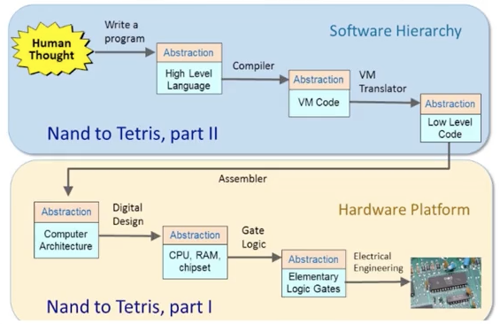
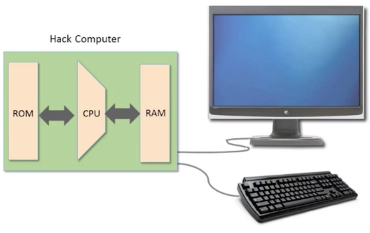
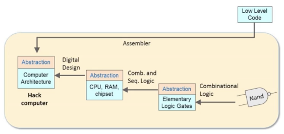
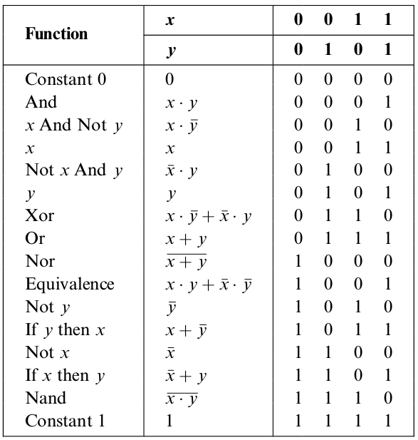
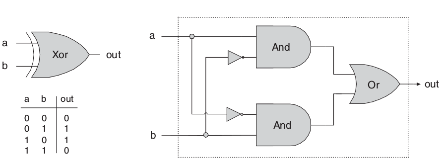
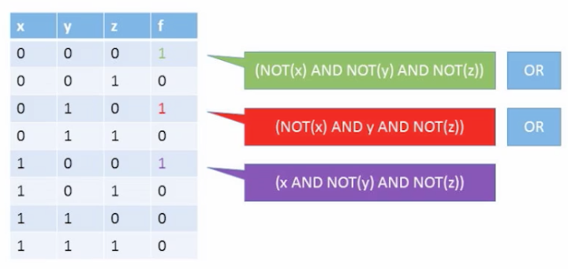

Build a Modern Computer from First Principles: From Nand to Tetris
==================================================================

(Part I)

In this project-centered course you will build a modern computer system,
from the ground up. In the process, you will learn - in the most direct
and constructive way - how computers work, and how they are designed.

**Resources**

-   [Course Link](https://www.coursera.org/learn/build-a-computer)
-   [The Elements of Computing Systems - Online
    (Partial)](http://www.nand2tetris.org/chapters/)
-   [Textbook](https://mitpress.mit.edu/books/elements-computing-systems)



This course is PART I. PART II is not available yet at the time of
writing this note (Read textbook for PART II).

DONE Week 0: Introduction
-------------------------

> Do not worry about the "how" (Implementation) only about the
> "what"(abstraction)

Good modular design implies that you can work on the individual modules
independently, while completely ignoring the rest of the system.

Multiple layers of abstraction, each layer is built based on interface
(API) of the previous layer without worrying about its implementation.



Image below is the course map for PART I.



IN-PROGRESS Week 1: Boolean Functions and Gate Logic Roadmap
------------------------------------------------------------

TODO:
-   [ ] READ HDL Survival Guide
    [HERE](http://www.nand2tetris.org/software/HDL%20Survival%20Guide.html)
-   [ ] READ Appendix A
    [HERE](http://www.nand2tetris.org/chapters/appendix%20A.pdf)
-   [ ] Course
    [FAQ](https://www.coursera.org/learn/build-a-computer/supplement/Dkosx/faq)
-   [ ] READ
    [THIS](http://www.nand2tetris.org/chapters/chapter%2001.pdf)
    Textbook

Chapter 01: Boolean Logic

**Key Concepts**

-   Boolean Algebra
-   Boolean Functions
-   Gate Logic
-   Elementary Logic Gates
-   Hardware Describe Language (HDL)
-   Hardware Simulation

### Reading Note

Chp. 1 focus on building Boolean Gates. Boolean algebra deals with
Boolean.

Truth Table Representation of the Function -\> enumerate all possible
values `2**n` of possible tuples

`x·y=/=xy` means `x AND y`, `x+y` means `x OR y`, horizontal line above
`x` means `NOT(x)`.

Canonical Representation, each boolean function can be expressed using
at least one boolean expression.

TODO: What does the line below means? Number of boolean function can be
defined over `n` binary variables is `2**2**n`.



*All the Boolean functions of two variables*

-   `NOR` is short for `NOT-OR`
-   `XOR` is short for `Exclusive OR`

=AND=, `OR`, `NOT` can be constructed using `NAND=/=NOR`, hence, every
boolean function be can constructed using `NAND=/=NOR`.

Gate, physical device that implementes a Boolean function.

Most today's gates are implemented as transistors etched in silicon,
packaged as chips.

Primitive gate, black-box that implements an elementary logical
operation.


*Standard Symbolic Notation of Some Elementary Logic Gates*

Primitive gates can be further combined/constructed into composite gate.


*Composite Gate Implementation: Three-way AND Gate*



*Xor Gate*

Any gate has two sides, *gate interface* (input & output) and *gate
architecture/implementation*. Gate Interface is unique, usually is
represented using truth table.

The art of logic design can be described as given a gate specification
(gate interface), find an efficient way to implement it using other
gates that were implemented.

### Boolean Logic

Abstract `0` and `1` can be tread as `OFF` / `False` and `ON` / `True`.

#### Boolean Expression

Boolean Expression, the combination of Boolean operations, for example,
`NOT(0 OR (1 AND 1))` which is `0`.

#### Boolean Function

Boolean Function (Formula), function that takes argument(s) and produces
an output, for example, `f(x, y, z) ` (x AND y) OR (NOT(x) AND z)=. Good
part of Boolean Function is that the possibility of input is finite
(Even can be listed inside a table, the number of row is
`2 ** NUM_OF_ARGUMENT`).

#### Boolean Operation

Boolean Operations (Refer [Truth
Table](https://en.wikipedia.org/wiki/Truth_table) for the result of
operations), see [Boolean
Algebra](https://en.wikipedia.org/wiki/Boolean_algebra) for more detail.
Main operations of Boolean Algebra are,

-   Conjunction `AND` / `∧`, `(x AND y)`, `x∧y`
-   Disjunction `OR` / `∨`, `(x OR y)`, `x∨y`
-   Negation `NOT` / `¬`, `NOT(x)`, `¬x` （Unary Operation)

#### Boolean Identity

Few common *Laws* ([Boolean
Identity](https://web.cs.dal.ca/~grundke/reference/boole.html)) are (Can
be proved using *Truth Table*),

-   Commutative Laws
-   `(x AND y) ` (y AND x)=
-   `(x OR y) ` (y OR x)=
-   Associative Laws
-   `(x AND (y AND z)) ` ((x AND y) AND z)=
-   `(x OR (y OR z)) ` ((x OR y) OR z)=
-   Distributive Laws
-   `(x AND (y OR z)) ` (x AND y) OR (x AND z)=
-   `(x OR (y AND z)) ` (x OR y) AND (x OR z)=
-   Double Negation Lows
-   `NOT(NOT(x)) ` x=
-   [De Morgan Laws](https://en.wikipedia.org/wiki/De_Morgan%27s_laws)
-   `NOT(x AND y) ` NOT(x) OR NOT(y)=
-   `NOT(x OR y) ` NOT(x) AND NOT(y)=
-   [Idempotence Laws](https://en.wikipedia.org/wiki/Idempotence)
-   `x AND x ` x=

The Boolean Function can be represented using *Boolean Expression* and
*Truth Table* (Identical Definition of the same Boolean Function). The
Boolean Function can be simplified using *laws* or using *truth table*
(sometime it is NOT easy to do).

The real task when working with a computer is to convert from *Truth
Table* into *Boolean Expression* which is constructing a [Disjunctive
Normal Form](https://en.wikipedia.org/wiki/Disjunctive_normal_form)
Formula.

**Convert From Truth Table to Boolean Expression**



``` {.example}
    (NOT(x) AND NOT(z)) OR (x AND NOT(y) AND NOT(z))
    (NOT(x) AND NOT(z)) OR (NOT(y) AND NOT(z))
    NOT(z) AND (NOT(x) OR NOT(y))
```

#### Truth Table Conversion To Boolean Expression

1.  Focus ONLY on expression that gets a value of `1`
2.  Get the boolean expression gets value `1` for that specific row ONLY
3.  Using `OR` to chain the boolean expressions
4.  Simplify the boolean expression using Laws mentioned above

However, the shortest and most efficient formula that's equivalent to
the target boolean expression usually is extreme hard to find/verify (It
is a [NP-hard Problem](https://en.wikipedia.org/wiki/NP-hardness)).

1.  The theorem is that any boolean function can be represented using an
    expression containing `AND`, `OR` and `NOT` operations. (Any boolean
    function can be presented using truth table representation)

2.  The theorem is that any boolean function can be represented using an
    expression containing `AND` and `NOT` operations (`OR` can be
    represented using `(x OR y) ` NOT(NOT(x) AND NOT(y))=).

3.  The theorem is that any boolean function can be represetned using an
    expression containing only `NAND` operations. (`NOT` can be
    represented using `NOT(x) ` (x NAND x)= and `AND` can be represented
    using `(x AND y) ` NOT(x NAND y)=)

\*NAND\* Operation, `(x NAND y) ` NOT(x AND y)=. **Nand**, is the basic
logical gate.

  x   y   NAND
  --- --- ------
  0   0   1
  0   1   1
  1   0   1
  1   1   0

### Logic Gate

Gate logic is an technique for implementing Boolean functions using
logic gates. There are two types of logic gate,

-   Elementary (`Nand`, `And`, `Or`, `Not`, etc.)
-   Composite (`Mux`, `Adder`, etc.)

/=NAND= Gate Diagram/

Gate interface is the gate abstraction. Tnterface answers the question
"what". The interface is unique, there is one and only one way to
describe what the gate does (There can be many implementations).

Circuit Implementations, the circuite implementation of boolean logic.

This course does not deal with physical implementations. Circuits,
transistors, relays are Electronic Enginnering, not Computer Science.

### Hardware Description Language

From abstraction to implementation.

The basic requirement (Gate/Chip Interface) to understand a gate/chip's
functionality are

-   Gate Diagram
-   Truth Table

HDL file is the text describtion of gate diagram. HDL should be
self-describetive and readable.

-   HDL is a functional/declarative language
-   The order of HDL statements is insignificant (Keep left to right for
    readability)
-   Before using a chip, know its interface first
-   `Not(in=, out=)`
-   `And(a=, b=, out=)`
-   `Or(a=, b=, out=)`
-   Connection like `partName(a=a, ..)` and `partName(.., out=out)` are
    common

Common HDLs are,

-   VHDL
-   Verilog
-   etc.

#### HDL Code

The HDL using in this course is special designed, which is similar to
other HDLs, simple and provide all the functionalities for this course.

``` {.example}
    /** gate: out = (a AND NOT(b)) OR (NOT(a) AND b) */

    CHIP Xor {
        // Name of input (Given)
        IN a, b;
        // Name of output (Given)
        OUT out;

        PARTS:
        // Implementation Here
        Not (in=a, out=nota);
        Not (in=b, out=notb);
        And (a=a, b=notb, output=aAndNotb);
        And (a=nota, b=b, out=notaAndb)
        Or (a=aAndNotb, b=notaAndb, out=out);
    }
```

### Multi-Bit Buses

Think of array of bits as a single entity (a.k.a. bus). HDLs usually
provide convenient notation for handling buses.

Bus can be composed from and breaken into sub-buses.
